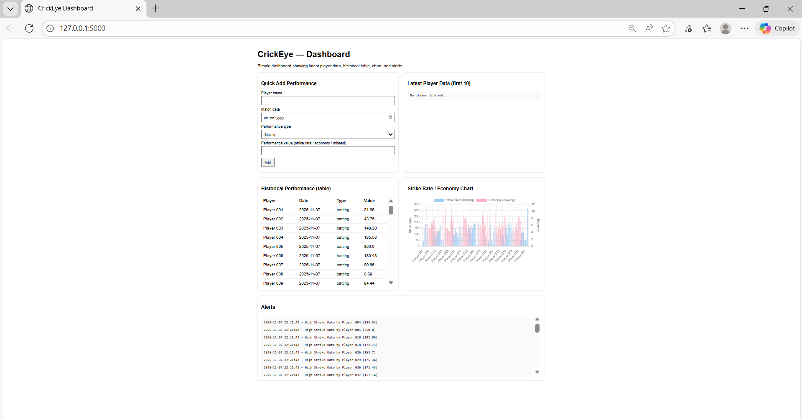

🏏 CrickEye — Real-Time Cricket Performance Monitoring Dashboard

## 🏏 CrickEye – Real-Time Cricket Performance Monitoring Dashboard

> 🧠 An interactive, data-driven dashboard to monitor cricket players’ batting, bowling, and fielding performances in real time.

Built using Flask (Python) for backend processing and HTML + CSS + JavaScript for the frontend.

CrickEye analyzes player data, triggers alerts for exceptional performances, and displays live analytics with charts and tables.

> 🧰 Project Overview

CrickEye is a full-stack web application that combines both data analytics and web development skills.

> ✅ Key Highlights:

Loads player stats from CSV files 🗂

Analyzes performances based on defined rules ⚙

Displays player stats and alerts on a live dashboard 📊

Allows users to manually add new player data in real-time ✍

> 🛠 Setup & Installation

🪜 Step 1: Install VS Code

Download and install Visual Studio Code from 👉 https://code.visualstudio.com/

After installation:

Open VS Code

Install the Python extension (search “Python” in Extensions tab 🔍)

> 🪜 Step 2: Install Python

Download the latest version of Python from 👉 https://www.python.org/downloads/
✅ During installation, make sure to check the box:

> “Add Python to PATH”

To confirm installation, open the VS Code terminal and type:

python --version

> 🪜 Step 3: Create a Virtual Environment

python -m venv venv

Activate it 👇

venv\Scripts\activate

> 🪜 Step 4: Install Required Libraries

pip install flask pandas

> 🪜 Step 5: Folder Setup

Your folder should look like this 👇

Crick_Eye/
│
├── app.py
├── requirements.txt
│
├── data/
│   ├── batting_100_players.csv
│   ├── bowling_100_players.csv
│
├── templates/
│   └── index.html
│
├── static/
│   └── script.js
│
└── venv/

> ⚙ Backend — Flask App

The Flask backend (app.py) is the heart of CrickEye 💓

🧩 Features:

Reads batting and bowling data from CSV files 📂

Stores all player data in memory (no database) ⚡

Analyzes performance according to rules 🎯

Generates alerts and serves them to the frontend 🔔

Provides JSON API endpoints for player data and alerts

🧠 Main API Endpoints:

Endpoint	    |        Method	           |                     Description
________________|__________________________|__________________________________________
    /	        |         GET	           |                  Loads dashboard UI
/player-data	|         GET	           |     Returns all player data (CSV + manually added)
/player-data	|         POST	           |              Adds new player data manually
/alerts	        |         GET	           |              Returns all generated alerts

🧠 Backend Analysis Rules:

Batting: Strike Rate > 150 → 🏏 “High Strike Rate”

Bowling: Economy < 6 → 🎯 “Good Bowling”

Fielding: Missed chances > 0 → 🧤 “Missed Fielding Opportunity”

When data meets these conditions, Flask automatically generates an alert and sends it to the frontend dashboard.

> 🎨 Frontend — Dashboard UI

The frontend files are inside:

templates/index.html
static/script.js

🧠 index.html

Built with HTML + CSS + Chart.js

Displays the dashboard with:

“Quick Add Player” form ✍

“Latest Player Data” section 📋

“Historical Performance” table 📈

“Strike Rate / Economy Chart” 🎯

“Alerts” section ⚠

⚙ script.js

Handles all frontend logic:

Fetches player data and alerts using Flask APIs

Updates the chart in real-time (Chart.js)

Displays new players instantly when added

Refreshes alerts without page reload

> 🧠 Performance Rules & Alerts

    Type	       |             Rule	           |          Alert Message	          |      Emoji
    _______________|_______________________________|__________________________________|____________________
                   |                               |                                  |
    Batting	       |        Strike Rate > 150	   |        High Strike Rate	      |        🏏
    Bowling	       |          Economy < 6	       |          Good Bowling	          |        🎯
    Fielding	   |          Missed > 0	       |    Missed Fielding Opportunity	  |        🧤

All alerts appear instantly on the dashboard in the “Alerts” panel with timestamps ⏰

> 📊 Charts & Visualizations

The chart uses Chart.js to show:

Batting Strike Rate bars 🏏

Bowling Economy bars 🎯

Both CSV data and newly added player data are shown together.
The chart updates instantly when a new player is added.

> 🚀 How to Run the Project

1️⃣ Activate your virtual environment (if not already activated)
2️⃣ Run the Flask server:

python app.py

3️⃣ Open your browser: 👉 http://127.0.0.1:5000/

✅ You’ll see the CrickEye Dashboard!

> 🧩 Project Structure

Crick_Eye/
│
├── app.py                     # Flask backend (main file)
├── requirements.txt           # Dependencies
│
├── data/
│   ├── batting_100_players.csv
│   ├── bowling_100_players.csv
│
├── templates/
│   └── index.html             # Dashboard page
│
├── static/
│   └── script.js              # JavaScript (fetch + charts)
│
└── venv/                      # Virtual environment

> 🧰 Tech Stack

       Layer	          |                  Technology	            |                Description
__________________________|_________________________________________|________________________________________
    🧠 Backend	         |                 Flask (Python)	       |           Handles logic, data, APIs
    🧮 Data	             |                    Pandas	           |           Reads and analyzes CSV files
    🎨 Frontend	         |              HTML, CSS, JavaScript	   |           UI structure and interactivity
    📊 Visualization	 |                   Chart.js	           |           Dynamic charts for performance
    💻 IDE	             |               Visual Studio Code	       |           Development environment

> 💬 How It Works (Simple Flow)

1️⃣ Flask loads existing CSV data 🗂
2️⃣ Dashboard displays players and charts 📊
3️⃣ You add new data via form ✍
4️⃣ Flask analyzes → if rule matched → alert generated ⚡
5️⃣ Dashboard updates instantly with new data & alerts 🔁